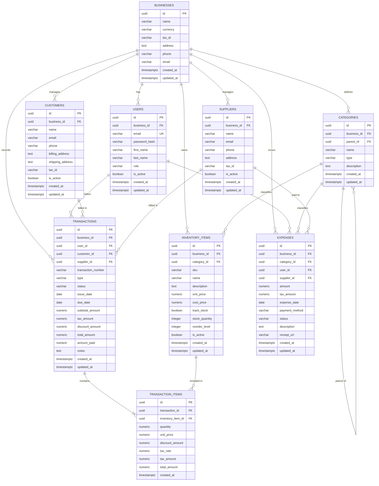

# Smart Billing System: Normalized PostgreSQL Database Design
**Author:** Senior Database Architect  
**Date:** August 3, 2026  
**Target Database:** PostgreSQL 16+  

---

## 1. Architectural Overview & Design Philosophy

This document presents a production-grade, highly normalized, and secure PostgreSQL database design for the **Smart Billing System**. The architecture is designed to support a multi-tenant, AI-powered business management platform that integrates billing, financial analytics, and a natural language AI assistant.

### Key Architectural Decisions

1. **Multi-Tenancy (Logical Isolation):**
   The system implements a **Shared Database, Shared Schema** multi-tenant architecture. A central `businesses` table acts as the tenant. All tenant-specific tables contain a `business_id` foreign key. This approach offers excellent resource utilization, simplified database migrations, and easy cross-tenant reporting for system administrators, while maintaining strict logical isolation via application-level filtering and Row-Level Security (RLS).

2. **UUIDv4 for Primary Keys:**
   All primary keys use the `UUID` data type (specifically UUIDv4). This prevents ID enumeration attacks (where competitors guess invoice or customer counts via sequential IDs), simplifies database replication, and allows safe client-side ID generation before database insertion.

3. **Historical Data Integrity (Snapshot Pattern):**
   In financial and billing systems, preserving historical accuracy is paramount. If an inventory item's price or tax rate changes, historical invoices must *not* change. To prevent this data corruption, the `transaction_items` table captures a **snapshot** of the `unit_price` and `tax_rate` at the exact moment the transaction is finalized.

4. **Polymorphic Transactions:**
   The `transactions` table is designed to handle both **Sales (Invoices to Customers)** and **Purchases (Bills from Suppliers)**. This unified design simplifies financial ledger reporting, cash flow forecasting, and AI-driven querying, while maintaining strict data integrity through PostgreSQL check constraints.

5. **Hierarchical Categorization (Adjacency List):**
   The `categories` table supports nested, hierarchical structures using a self-referencing `parent_id` foreign key. This allows businesses to organize inventory and expenses into granular subcategories (e.g., `Expenses -> Utilities -> Electricity`).

6. **Precise Numeric Types:**
   To prevent floating-point rounding errors (which are unacceptable in financial applications), all monetary values use the `NUMERIC(12, 2)` type (supporting up to $9,999,999,999.99), and quantities use `NUMERIC(10, 2)` to support fractional quantities (e.g., hours of service, kilograms of material).

---

## 2. Entity-Relationship (ER) Diagram

The following Mermaid diagram illustrates the database schema, including tables, columns, data types, keys, and relationships.

---

## 3. Detailed Table Descriptions & Schema Specifications

### 3.1 Table: `businesses` (Tenant)
Stores the profile and configuration details for each business (tenant) using the system.

| Column Name | Data Type | Constraints | Default Value | Description |
| :--- | :--- | :--- | :--- | :--- |
| `id` | `UUID` | `PRIMARY KEY` | `gen_random_uuid()` | Unique identifier for the business. |
| `name` | `VARCHAR(255)` | `NOT NULL` | *None* | Legal name of the business. |
| `currency` | `VARCHAR(3)` | `NOT NULL` | `'USD'` | ISO 4217 currency code (e.g., 'USD', 'EUR', 'INR'). |
| `tax_id` | `VARCHAR(50)` | `NULL` | *None* | Business tax registration number (e.g., EIN, VAT, GST). |
| `address` | `TEXT` | `NULL` | *None* | Physical and billing address of the business. |
| `phone` | `VARCHAR(50)` | `NULL` | *None* | Primary contact phone number. |
| `email` | `VARCHAR(255)` | `NULL` | *None* | Primary contact email address. |
| `created_at` | `TIMESTAMPTZ` | `NOT NULL` | `CURRENT_TIMESTAMP` | Timestamp when the business was registered. |
| `updated_at` | `TIMESTAMPTZ` | `NOT NULL` | `CURRENT_TIMESTAMP` | Timestamp of the last profile update. |

---

### 3.2 Table: `users`
Stores authentication, profile, and role-based access control (RBAC) details for system users.

| Column Name | Data Type | Constraints | Default Value | Description |
| :--- | :--- | :--- | :--- | :--- |
| `id` | `UUID` | `PRIMARY KEY` | `gen_random_uuid()` | Unique identifier for the user. |
| `business_id` | `UUID` | `FOREIGN KEY`, `NOT NULL` | *None* | References `businesses(id)`. Strict tenant isolation. |
| `email` | `VARCHAR(255)` | `UNIQUE`, `NOT NULL` | *None* | User's email address (used for login). |
| `password_hash` | `VARCHAR(255)` | `NOT NULL` | *None* | Securely hashed password (e.g., Argon2id or bcrypt). |
| `first_name` | `VARCHAR(100)` | `NOT NULL` | *None* | User's first name. |
| `last_name` | `VARCHAR(100)` | `NOT NULL` | *None* | User's last name. |
| `role` | `VARCHAR(50)` | `NOT NULL` | *None* | RBAC role. Allowed: `'admin'`, `'staff'`. |
| `is_active` | `BOOLEAN` | `NOT NULL` | `TRUE` | Flag to enable/disable user access. |
| `created_at` | `TIMESTAMPTZ` | `NOT NULL` | `CURRENT_TIMESTAMP` | Timestamp when the user was created. |
| `updated_at` | `TIMESTAMPTZ` | `NOT NULL` | `CURRENT_TIMESTAMP` | Timestamp of the last user profile update. |

---

### 3.3 Table: `categories`
Supports hierarchical categorization for both inventory items and business expenses.

| Column Name | Data Type | Constraints | Default Value | Description |
| :--- | :--- | :--- | :--- | :--- |
| `id` | `UUID` | `PRIMARY KEY` | `gen_random_uuid()` | Unique identifier for the category. |
| `business_id` | `UUID` | `FOREIGN KEY`, `NOT NULL` | *None* | References `businesses(id)`. Tenant isolation. |
| `parent_id` | `UUID` | `FOREIGN KEY`, `NULL` | `NULL` | References `categories(id)`. Self-reference for hierarchy. |
| `name` | `VARCHAR(100)` | `NOT NULL` | *None* | Name of the category. |
| `type` | `VARCHAR(50)` | `NOT NULL` | *None* | Category type. Allowed: `'inventory'`, `'expense'`. |
| `description` | `TEXT` | `NULL` | *None* | Detailed description of the category. |
| `created_at` | `TIMESTAMPTZ` | `NOT NULL` | `CURRENT_TIMESTAMP` | Timestamp when the category was created. |
| `updated_at` | `TIMESTAMPTZ` | `NOT NULL` | `CURRENT_TIMESTAMP` | Timestamp of the last category update. |

*Table-Level Constraints:*
- **Unique Constraint:** `UNIQUE (business_id, parent_id, name, type)` — Prevents duplicate category names at the same hierarchical level within a business.
- **Check Constraint:** `CHECK (type IN ('inventory', 'expense'))` — Restricts category types to valid options.
- **Check Constraint:** `CHECK (id <> parent_id)` — Prevents a category from being its own parent (direct circular reference).

---

### 3.4 Table: `customers`
Stores contact and billing information for clients who purchase goods or services.

| Column Name | Data Type | Constraints | Default Value | Description |
| :--- | :--- | :--- | :--- | :--- |
| `id` | `UUID` | `PRIMARY KEY` | `gen_random_uuid()` | Unique identifier for the customer. |
| `business_id` | `UUID` | `FOREIGN KEY`, `NOT NULL` | *None* | References `businesses(id)`. Tenant isolation. |
| `name` | `VARCHAR(255)` | `NOT NULL` | *None* | Full name of the customer or client company. |
| `email` | `VARCHAR(255)` | `NULL` | *None* | Customer's billing email address. |
| `phone` | `VARCHAR(50)` | `NULL` | *None* | Customer's contact phone number. |
| `billing_address` | `TEXT` | `NULL` | *None* | Address used for invoicing. |
| `shipping_address` | `TEXT` | `NULL` | *None* | Address used for physical deliveries. |
| `tax_id` | `VARCHAR(50)` | `NULL` | *None* | Customer's tax registration number (e.g., VAT, GST). |
| `is_active` | `BOOLEAN` | `NOT NULL` | `TRUE` | Soft-delete flag to deactivate customers. |
| `created_at` | `TIMESTAMPTZ` | `NOT NULL` | `CURRENT_TIMESTAMP` | Timestamp when the customer was added. |
| `updated_at` | `TIMESTAMPTZ` | `NOT NULL` | `CURRENT_TIMESTAMP` | Timestamp of the last customer update. |

*Table-Level Constraints:*
- **Unique Constraint:** `UNIQUE (business_id, email)` — Prevents duplicate customer emails within the same business tenant (allows nulls).

---

### 3.5 Table: `suppliers`
Stores contact and billing information for vendors from whom the business purchases inventory or services.

| Column Name | Data Type | Constraints | Default Value | Description |
| :--- | :--- | :--- | :--- | :--- |
| `id` | `UUID` | `PRIMARY KEY` | `gen_random_uuid()` | Unique identifier for the supplier. |
| `business_id` | `UUID` | `FOREIGN KEY`, `NOT NULL` | *None* | References `businesses(id)`. Tenant isolation. |
| `name` | `VARCHAR(255)` | `NOT NULL` | *None* | Supplier company name. |
| `email` | `VARCHAR(255)` | `NULL` | *None* | Supplier's contact email address. |
| `phone` | `VARCHAR(50)` | `NULL` | *None* | Supplier's contact phone number. |
| `address` | `TEXT` | `NULL` | *None* | Supplier's physical address. |
| `tax_id` | `VARCHAR(50)` | `NULL` | *None* | Supplier's tax registration number. |
| `is_active` | `BOOLEAN` | `NOT NULL` | `TRUE` | Soft-delete flag to deactivate suppliers. |
| `created_at` | `TIMESTAMPTZ` | `NOT NULL` | `CURRENT_TIMESTAMP` | Timestamp when the supplier was added. |
| `updated_at` | `TIMESTAMPTZ` | `NOT NULL` | `CURRENT_TIMESTAMP` | Timestamp of the last supplier update. |

*Table-Level Constraints:*
- **Unique Constraint:** `UNIQUE (business_id, email)` — Prevents duplicate supplier emails within the same business tenant (allows nulls).

---

### 3.6 Table: `inventory_items`
Represents products or services offered by the business. Tracks stock levels and pricing.

| Column Name | Data Type | Constraints | Default Value | Description |
| :--- | :--- | :--- | :--- | :--- |
| `id` | `UUID` | `PRIMARY KEY` | `gen_random_uuid()` | Unique identifier for the item. |
| `business_id` | `UUID` | `FOREIGN KEY`, `NOT NULL` | *None* | References `businesses(id)`. Tenant isolation. |
| `category_id` | `UUID` | `FOREIGN KEY`, `NULL` | `NULL` | References `categories(id)`. Must be of type `'inventory'`. |
| `sku` | `VARCHAR(100)` | `NULL` | *None* | Stock Keeping Unit (unique code for physical tracking). |
| `name` | `VARCHAR(255)` | `NOT NULL` | *None* | Name of the product or service. |
| `description` | `TEXT` | `NULL` | *None* | Detailed description of the item. |
| `unit_price` | `NUMERIC(12, 2)` | `NOT NULL` | *None* | Default selling price to customers. |
| `cost_price` | `NUMERIC(12, 2)` | `NOT NULL` | `0.00` | Purchase cost from suppliers (used for profit margin analysis). |
| `track_stock` | `BOOLEAN` | `NOT NULL` | `FALSE` | `TRUE` for physical goods, `FALSE` for services. |
| `stock_quantity` | `INTEGER` | `NOT NULL` | `0` | Current physical stock level. |
| `reorder_level` | `INTEGER` | `NOT NULL` | `0` | Stock threshold to trigger reorder alerts. |
| `is_active` | `BOOLEAN` | `NOT NULL` | `TRUE` | Soft-delete flag to deactivate items. |
| `created_at` | `TIMESTAMPTZ` | `NOT NULL` | `CURRENT_TIMESTAMP` | Timestamp when the item was created. |
| `updated_at` | `TIMESTAMPTZ` | `NOT NULL` | `CURRENT_TIMESTAMP` | Timestamp of the last item update. |

*Table-Level Constraints:*
- **Unique Constraint:** `UNIQUE (business_id, sku)` — Prevents duplicate SKUs within the same business tenant (allows nulls for services).
- **Check Constraint:** `CHECK (unit_price >= 0)` — Prevents negative selling prices.
- **Check Constraint:** `CHECK (cost_price >= 0)` — Prevents negative cost prices.
- **Check Constraint:** `CHECK (stock_quantity >= 0 OR NOT track_stock)` — Prevents negative stock if stock tracking is enabled.

---

### 3.7 Table: `transactions`
Represents financial billing documents. This table is polymorphic, acting as an **Invoice (Sale)** when `type = 'sale'` or a **Bill (Purchase)** when `type = 'purchase'`.

| Column Name | Data Type | Constraints | Default Value | Description |
| :--- | :--- | :--- | :--- | :--- |
| `id` | `UUID` | `PRIMARY KEY` | `gen_random_uuid()` | Unique identifier for the transaction. |
| `business_id` | `UUID` | `FOREIGN KEY`, `NOT NULL` | *None* | References `businesses(id)`. Tenant isolation. |
| `user_id` | `UUID` | `FOREIGN KEY`, `NOT NULL` | *None* | References `users(id)`. The user who created the record. |
| `customer_id` | `UUID` | `FOREIGN KEY`, `NULL` | `NULL` | References `customers(id)`. Required if `type = 'sale'`. |
| `supplier_id` | `UUID` | `FOREIGN KEY`, `NULL` | `NULL` | References `suppliers(id)`. Required if `type = 'purchase'`. |
| `transaction_number` | `VARCHAR(100)` | `NOT NULL` | *None* | Human-readable invoice/bill number (e.g., INV-1001). |
| `type` | `VARCHAR(50)` | `NOT NULL` | *None* | Transaction type. Allowed: `'sale'`, `'purchase'`. |
| `status` | `VARCHAR(50)` | `NOT NULL` | *None* | Payment status. Allowed: `'draft'`, `'sent'`, `'paid'`, `'partially_paid'`, `'overdue'`, `'voided'`. |
| `issue_date` | `DATE` | `NOT NULL` | *None* | Date the invoice/bill was issued. |
| `due_date` | `DATE` | `NULL` | *None* | Payment deadline. |
| `subtotal_amount` | `NUMERIC(12, 2)` | `NOT NULL` | *None* | Sum of all line items before taxes and discounts. |
| `tax_amount` | `NUMERIC(12, 2)` | `NOT NULL` | `0.00` | Total tax applied to the transaction. |
| `discount_amount` | `NUMERIC(12, 2)` | `NOT NULL` | `0.00` | Total discount applied to the transaction. |
| `total_amount` | `NUMERIC(12, 2)` | `NOT NULL` | *None* | Final amount due: `subtotal_amount + tax_amount - discount_amount`. |
| `amount_paid` | `NUMERIC(12, 2)` | `NOT NULL` | `0.00` | Total amount paid so far (tracks partial payments). |
| `notes` | `TEXT` | `NULL` | *None* | Terms, conditions, or general notes. |
| `created_at` | `TIMESTAMPTZ` | `NOT NULL` | `CURRENT_TIMESTAMP` | Timestamp when the transaction was logged. |
| `updated_at` | `TIMESTAMPTZ` | `NOT NULL` | `CURRENT_TIMESTAMP` | Timestamp of the last transaction update. |

*Table-Level Constraints:*
- **Unique Constraint:** `UNIQUE (business_id, type, transaction_number)` — Prevents duplicate invoice numbers or bill numbers within the same business.
- **Check Constraint:** `CHECK (type IN ('sale', 'purchase'))` — Restricts transaction types.
- **Check Constraint:** `CHECK (status IN ('draft', 'sent', 'paid', 'partially_paid', 'overdue', 'voided'))` — Restricts status values.
- **Check Constraint:** `CHECK (due_date >= issue_date)` — Ensures the payment deadline is not before the issue date.
- **Check Constraint:** `CHECK (total_amount = subtotal_amount + tax_amount - discount_amount)` — Enforces mathematical consistency.
- **Check Constraint:** `CHECK (amount_paid >= 0 AND amount_paid <= total_amount)` — Prevents invalid payment tracking.
- **Polymorphic Check Constraint:**  
  `CHECK ((type = 'sale' AND customer_id IS NOT NULL AND supplier_id IS NULL) OR (type = 'purchase' AND supplier_id IS NOT NULL AND customer_id IS NULL))`  
  *Justification:* Ensures that sales are strictly linked to customers, and purchases are strictly linked to suppliers, preventing logical data corruption.

---

### 3.8 Table: `transaction_items`
Represents individual line items within a transaction. Captures historical pricing snapshots.

| Column Name | Data Type | Constraints | Default Value | Description |
| :--- | :--- | :--- | :--- | :--- |
| `id` | `UUID` | `PRIMARY KEY` | `gen_random_uuid()` | Unique identifier for the line item. |
| `transaction_id` | `UUID` | `FOREIGN KEY`, `NOT NULL` | *None* | References `transactions(id)`. Cascades on delete. |
| `inventory_item_id` | `UUID` | `FOREIGN KEY`, `NOT NULL` | *None* | References `inventory_items(id)`. |
| `quantity` | `NUMERIC(10, 2)` | `NOT NULL` | *None* | Quantity purchased or sold (supports decimals). |
| `unit_price` | `NUMERIC(12, 2)` | `NOT NULL` | *None* | **Snapshot** of the item's unit price at transaction time. |
| `discount_amount` | `NUMERIC(12, 2)` | `NOT NULL` | `0.00` | Line-item specific discount. |
| `tax_rate` | `NUMERIC(5, 2)` | `NOT NULL` | `0.00` | **Snapshot** of the tax rate percentage (e.g., `18.00` for 18%). |
| `tax_amount` | `NUMERIC(12, 2)` | `NOT NULL` | `0.00` | Calculated tax: `((quantity * unit_price) - discount_amount) * (tax_rate / 100)`. |
| `total_amount` | `NUMERIC(12, 2)` | `NOT NULL` | *None* | Final line total: `((quantity * unit_price) - discount_amount) + tax_amount`. |
| `created_at` | `TIMESTAMPTZ` | `NOT NULL` | `CURRENT_TIMESTAMP` | Timestamp when the line item was added. |

*Table-Level Constraints:*
- **Check Constraint:** `CHECK (quantity > 0)` — Prevents zero or negative quantities.
- **Check Constraint:** `CHECK (unit_price >= 0)` — Prevents negative unit prices.
- **Check Constraint:** `CHECK (discount_amount >= 0 AND discount_amount <= (quantity * unit_price))` — Prevents discounts from exceeding the item subtotal.
- **Check Constraint:** `CHECK (tax_rate >= 0 AND tax_rate <= 100)` — Restricts tax rates to realistic percentages.
- **Check Constraint:** `CHECK (total_amount = ((quantity * unit_price) - discount_amount) + tax_amount)` — Enforces mathematical consistency.

---

### 3.9 Table: `expenses`
Tracks general business expenditures (e.g., rent, software, utilities) that are not direct inventory purchases.

| Column Name | Data Type | Constraints | Default Value | Description |
| :--- | :--- | :--- | :--- | :--- |
| `id` | `UUID` | `PRIMARY KEY` | `gen_random_uuid()` | Unique identifier for the expense. |
| `business_id` | `UUID` | `FOREIGN KEY`, `NOT NULL` | *None* | References `businesses(id)`. Tenant isolation. |
| `category_id` | `UUID` | `FOREIGN KEY`, `NOT NULL` | *None* | References `categories(id)`. Must be of type `'expense'`. |
| `user_id` | `UUID` | `FOREIGN KEY`, `NOT NULL` | *None* | References `users(id)`. The user who logged the expense. |
| `supplier_id` | `UUID` | `FOREIGN KEY`, `NULL` | `NULL` | References `suppliers(id)`. Optional vendor paid. |
| `amount` | `NUMERIC(12, 2)` | `NOT NULL` | *None* | Total expense amount (including tax). |
| `tax_amount` | `NUMERIC(12, 2)` | `NOT NULL` | `0.00` | Tax portion of the expense (for tax write-off tracking). |
| `expense_date` | `DATE` | `NOT NULL` | *None* | Date the expense was incurred. |
| `payment_method` | `VARCHAR(50)` | `NOT NULL` | *None* | Payment method. Allowed: `'cash'`, `'bank_transfer'`, `'credit_card'`, `'check'`. |
| `status` | `VARCHAR(50)` | `NOT NULL` | *None* | Expense status. Allowed: `'paid'`, `'pending'`, `'approved'`, `'rejected'`. |
| `description` | `TEXT` | `NULL` | *None* | Description of the expense. |
| `receipt_url` | `VARCHAR(2048)` | `NULL` | *None* | URL to the scanned receipt or invoice document. |
| `created_at` | `TIMESTAMPTZ` | `NOT NULL` | `CURRENT_TIMESTAMP` | Timestamp when the expense was logged. |
| `updated_at` | `TIMESTAMPTZ` | `NOT NULL` | `CURRENT_TIMESTAMP` | Timestamp of the last expense update. |

*Table-Level Constraints:*
- **Check Constraint:** `CHECK (amount > 0)` — Prevents zero or negative expense amounts.
- **Check Constraint:** `CHECK (tax_amount >= 0 AND tax_amount <= amount)` — Prevents tax from exceeding the total amount.
- **Check Constraint:** `CHECK (payment_method IN ('cash', 'bank_transfer', 'credit_card', 'check'))` — Restricts payment methods.
- **Check Constraint:** `CHECK (status IN ('paid', 'pending', 'approved', 'rejected'))` — Restricts status values.

---

## 4. Database Relationships & Referential Integrity

To maintain absolute data integrity, the database enforces strict referential integrity rules. Below is a detailed breakdown of every relationship, its cardinality, and its referential actions (e.g., `ON DELETE`).

### 4.1 Relationship Matrix

| Parent Table | Child Table | Cardinality | Foreign Key Column | On Delete Action | On Update Action |
| :--- | :--- | :--- | :--- | :--- | :--- |
| `businesses` | `users` | 1:N | `users.business_id` | `RESTRICT` | `CASCADE` |
| `businesses` | `categories` | 1:N | `categories.business_id` | `CASCADE` | `CASCADE` |
| `businesses` | `customers` | 1:N | `customers.business_id` | `RESTRICT` | `CASCADE` |
| `businesses` | `suppliers` | 1:N | `suppliers.business_id` | `RESTRICT` | `CASCADE` |
| `businesses` | `inventory_items` | 1:N | `inventory_items.business_id` | `RESTRICT` | `CASCADE` |
| `businesses` | `transactions` | 1:N | `transactions.business_id` | `RESTRICT` | `CASCADE` |
| `businesses` | `expenses` | 1:N | `expenses.business_id` | `RESTRICT` | `CASCADE` |
| `categories` | `categories` | 1:N (Self) | `categories.parent_id` | `RESTRICT` | `CASCADE` |
| `categories` | `inventory_items` | 1:N | `inventory_items.category_id` | `SET NULL` | `CASCADE` |
| `categories` | `expenses` | 1:N | `expenses.category_id` | `RESTRICT` | `CASCADE` |
| `users` | `transactions` | 1:N | `transactions.user_id` | `RESTRICT` | `CASCADE` |
| `users` | `expenses` | 1:N | `expenses.user_id` | `RESTRICT` | `CASCADE` |
| `customers` | `transactions` | 1:N | `transactions.customer_id` | `RESTRICT` | `CASCADE` |
| `suppliers` | `transactions` | 1:N | `transactions.supplier_id` | `RESTRICT` | `CASCADE` |
| `suppliers` | `expenses` | 1:N | `expenses.supplier_id` | `SET NULL` | `CASCADE` |
| `transactions` | `transaction_items` | 1:N | `transaction_items.transaction_id` | `CASCADE` | `CASCADE` |
| `inventory_items` | `transaction_items` | 1:N | `transaction_items.inventory_item_id` | `RESTRICT` | `CASCADE` |

---

### 4.2 Justification for Every Relationship

#### 1. `businesses` ➔ `users` (1:N)
* **Business Justification:** A business tenant must have employees (users) who manage the billing system. Multiple users (e.g., Admin, Staff) can belong to a single business.
* **Technical Justification:** Enforces strict multi-tenant isolation. The `ON DELETE RESTRICT` action prevents a business from being deleted if users are still associated with it, protecting against accidental data loss.

#### 2. `businesses` ➔ `categories` (1:N)
* **Business Justification:** Each business has its own unique way of categorizing inventory and expenses. For example, a consulting firm has different categories than a retail store.
* **Technical Justification:** Allows custom, tenant-specific taxonomies. `ON DELETE CASCADE` ensures that if a business is offboarded and deleted, all its custom categories are automatically purged.

#### 3. `businesses` ➔ `customers` & `suppliers` (1:N)
* **Business Justification:** Businesses maintain private directories of their clients (customers) and vendors (suppliers). These directories must never leak across tenants.
* **Technical Justification:** Guarantees data privacy and security. `ON DELETE RESTRICT` prevents deleting a business that has active customer or supplier records, ensuring financial history is preserved.

#### 4. `businesses` ➔ `inventory_items` (1:N)
* **Business Justification:** Each business sells its own catalog of products or services.
* **Technical Justification:** Isolates inventory catalogs. `ON DELETE RESTRICT` prevents deleting a business with active inventory items.

#### 5. `businesses` ➔ `transactions` & `expenses` (1:N)
* **Business Justification:** Financial transactions (invoices, bills) and expenses are the core financial ledger of a business and must be strictly owned by that business.
* **Technical Justification:** Ensures absolute tenant isolation for financial reporting. `ON DELETE RESTRICT` acts as a safety lock, preventing the deletion of a business that has recorded financial activity.

#### 6. `categories` ➔ `categories` (1:N Self-Reference)
* **Business Justification:** Businesses require nested subcategories (e.g., `Office Expenses` ➔ `Stationery` ➔ `Pens`) for granular financial reporting and AI-driven analysis.
* **Technical Justification:** Implements the Adjacency List model for hierarchical trees. `ON DELETE RESTRICT` prevents deleting a parent category if it has active subcategories, preventing orphaned nodes.

#### 7. `categories` ➔ `inventory_items` (1:N)
* **Business Justification:** Inventory items must be categorized (e.g., "Hardware", "Services") to allow structured browsing and category-level sales analytics.
* **Technical Justification:** `ON DELETE SET NULL` is used here. If a category is deleted, the inventory items are not deleted; instead, their `category_id` is set to `NULL` (uncategorized), preserving the items and their sales history.

#### 8. `categories` ➔ `expenses` (1:N)
* **Business Justification:** Expenses must be categorized (e.g., "Rent", "Travel") for tax reporting and cash flow analysis.
* **Technical Justification:** `ON DELETE RESTRICT` prevents deleting an expense category if expenses have already been logged under it, protecting historical tax and financial records.

#### 9. `users` ➔ `transactions` & `expenses` (1:N)
* **Business Justification:** For audit trails and security, the system must track exactly which employee created an invoice, logged a bill, or submitted an expense.
* **Technical Justification:** Establishes accountability and auditability. `ON DELETE RESTRICT` prevents deleting a user account if they have authored financial records, preserving the audit trail.

#### 10. `customers` ➔ `transactions` (1:N)
* **Business Justification:** A customer can receive multiple invoices over time.
* **Technical Justification:** Links sales transactions to the buyer. `ON DELETE RESTRICT` prevents deleting a customer if they have historical invoices, which is critical for tax compliance and financial audits.

#### 11. `suppliers` ➔ `transactions` (1:N)
* **Business Justification:** A business receives multiple bills from the same supplier.
* **Technical Justification:** Links purchase transactions to the vendor. `ON DELETE RESTRICT` prevents deleting a supplier with active bills, preserving purchase history.

#### 12. `suppliers` ➔ `expenses` (1:N)
* **Business Justification:** General expenses (like a software subscription) can optionally be linked to a supplier (e.g., AWS, Microsoft) for vendor spend analysis.
* **Technical Justification:** `ON DELETE SET NULL` is used because linking an expense to a supplier is optional. If the supplier is deleted, the expense record remains intact, but the supplier reference is cleared.

#### 13. `transactions` ➔ `transaction_items` (1:N)
* **Business Justification:** An invoice or bill consists of multiple line items (e.g., 2 laptops, 1 mouse).
* **Technical Justification:** Normalizes the transaction structure. `ON DELETE CASCADE` ensures that if an entire transaction (invoice) is deleted or voided, all its associated line items are deleted automatically, preventing orphaned line items.

#### 14. `inventory_items` ➔ `transaction_items` (1:N)
* **Business Justification:** A product or service can be sold or purchased across many different transactions.
* **Technical Justification:** `ON DELETE RESTRICT` prevents deleting an inventory item if it has been sold or purchased in the past. This is a critical financial constraint; deleting the item would break historical invoice line items and corrupt financial reports.

---

## 5. Comprehensive Indexing Strategy

To ensure sub-millisecond query response times and support real-time AI RAG (Retrieval-Augmented Generation) queries, a robust indexing strategy is designed. PostgreSQL uses B-Tree indexes by default, which are ideal for equality and range queries.

### 5.1 Primary & Foreign Key Indexes
PostgreSQL automatically creates unique indexes for Primary Keys, but **does not** automatically index Foreign Keys. Without explicit indexes on foreign keys, joins between tables (e.g., joining `transactions` and `transaction_items`) will result in slow sequential table scans.

The following foreign key indexes are mandatory:
1. `idx_users_business_id` ON `users(business_id)`
2. `idx_categories_business_id` ON `categories(business_id)`
3. `idx_categories_parent_id` ON `categories(parent_id)`
4. `idx_customers_business_id` ON `customers(business_id)`
5. `idx_suppliers_business_id` ON `suppliers(business_id)`
6. `idx_inventory_items_business_id` ON `inventory_items(business_id)`
7. `idx_inventory_items_category_id` ON `inventory_items(category_id)`
8. `idx_transactions_business_id` ON `transactions(business_id)`
9. `idx_transactions_user_id` ON `transactions(user_id)`
10. `idx_transactions_customer_id` ON `transactions(customer_id)`
11. `idx_transactions_supplier_id` ON `transactions(supplier_id)`
12. `idx_transaction_items_transaction_id` ON `transaction_items(transaction_id)`
13. `idx_transaction_items_inventory_item_id` ON `transaction_items(inventory_item_id)`
14. `idx_expenses_business_id` ON `expenses(business_id)`
15. `idx_expenses_category_id` ON `expenses(category_id)`
16. `idx_expenses_user_id` ON `expenses(user_id)`
17. `idx_expenses_supplier_id` ON `expenses(supplier_id)`

---

### 5.2 Unique & Case-Insensitive Indexes
To enforce business rules and prevent duplicate data, unique indexes are applied. Since email addresses, SKUs, and transaction numbers are often entered with varying cases, we use **Functional Unique Indexes** with `LOWER()` to enforce case-insensitive uniqueness.

1. **Case-Insensitive User Email Uniqueness:**
   * **Index:** `uq_users_email_lower` ON `users(LOWER(email))`
   * **Purpose:** Prevents registering `user@example.com` and `User@example.com` as separate accounts.

2. **Case-Insensitive Customer Email per Tenant:**
   * **Index:** `uq_customers_business_email_lower` ON `customers(business_id, LOWER(email))`
   * **Purpose:** Prevents duplicate customer profiles within the same business, while allowing different businesses to have customers with the same email.

3. **Case-Insensitive Supplier Email per Tenant:**
   * **Index:** `uq_suppliers_business_email_lower` ON `suppliers(business_id, LOWER(email))`
   * **Purpose:** Prevents duplicate supplier profiles within the same business.

4. **Case-Insensitive SKU per Tenant:**
   * **Index:** `uq_inventory_items_business_sku_lower` ON `inventory_items(business_id, LOWER(sku))`
   * **Purpose:** Enforces unique SKUs within a business's inventory catalog.

5. **Case-Insensitive Transaction Number per Type and Tenant:**
   * **Index:** `uq_transactions_business_type_number_lower` ON `transactions(business_id, type, LOWER(transaction_number))`
   * **Purpose:** Prevents a business from creating two invoices with the number `INV-1001`, or two bills with the number `BILL-5002`.

---

### 5.3 Performance & Analytics Indexes (Composite & Partial)
Billing dashboards and AI assistants perform complex filtering, sorting, and aggregations. Standard single-column indexes are often insufficient. We design specialized **Composite Indexes** (multi-column) and **Partial Indexes** (filtered) to optimize these queries.

1. **Real-Time Revenue & Cash Flow Analytics:**
   * **Index:** `idx_transactions_analytics` ON `transactions(business_id, type, status, issue_date)`
   * **Purpose:** Speeds up dashboard queries that calculate monthly revenue, outstanding invoices, and cash flow trends.
   * **Query Optimized:** `SELECT SUM(total_amount) FROM transactions WHERE business_id = ? AND type = 'sale' AND status = 'paid' AND issue_date BETWEEN ? AND ?`

2. **Expense Analysis Dashboard:**
   * **Index:** `idx_expenses_analytics` ON `expenses(business_id, category_id, expense_date)`
   * **Purpose:** Speeds up queries that categorize business expenditures over time.
   * **Query Optimized:** `SELECT category_id, SUM(amount) FROM expenses WHERE business_id = ? AND expense_date BETWEEN ? AND ? GROUP BY category_id`

3. **Overdue Invoice Alerting (Partial Index):**
   * **Index:** `idx_transactions_overdue_partial` ON `transactions(business_id, due_date)` WHERE `status = 'sent' OR status = 'partially_paid'`
   * **Purpose:** A partial index that only indexes unpaid transactions. This keeps the index extremely small and fast, allowing the system to instantly find invoices that have passed their due date.
   * **Query Optimized:** `SELECT * FROM transactions WHERE status = 'sent' AND due_date < CURRENT_DATE`

4. **Active Inventory Search:**
   * **Index:** `idx_inventory_items_search` ON `inventory_items(business_id, is_active, name)`
   * **Purpose:** Speeds up auto-complete search bars in the billing UI when staff are adding items to an invoice.

5. **Trigram Index for Fuzzy Search (GIN):**
   * **Index:** `idx_customers_name_trgm` ON `customers` USING `gin (name gin_trgm_ops)`
   * **Purpose:** Supports fast fuzzy-matching search for customer names (e.g., searching "John" matches "Jon", "Johnathan", or "John's Corp") which is highly utilized by the AI Assistant's natural language search.

---

## 6. Normalization & Verification Analysis

A critical duty of a database architect is to mathematically verify that the schema is free of redundancy and update anomalies.

### 6.1 First Normal Form (1NF) Verification
* **Requirement:** All table attributes must be atomic (no arrays, comma-separated lists, or nested structures), and there must be a defined primary key.
* **Analysis:** 
  * Every table in this design has a single-column `UUID` primary key.
  * All columns store atomic values (e.g., `address` is a single text block, but structured billing/shipping addresses are separated in `customers` to maintain atomicity).
  * There are no repeating groups or multi-valued columns.
* **Status:** **Passed 1NF**

### 6.2 Second Normal Form (2NF) Verification
* **Requirement:** Must be in 1NF, and all non-key attributes must be fully functionally dependent on the entire primary key (no partial dependencies on composite keys).
* **Analysis:**
  * Since every table uses a single-column surrogate primary key (`id` of type `UUID`), there are no composite primary keys.
  * Therefore, partial key dependencies are mathematically impossible. Every non-key attribute is fully dependent on the single `id` column.
* **Status:** **Passed 2NF**

### 6.3 Third Normal Form (3NF) Verification
* **Requirement:** Must be in 2NF, and there must be no transitive dependencies (non-key attributes depending on other non-key attributes).
* **Analysis:**
  * In `users`, all fields (name, email, role) depend strictly on the user `id`.
  * In `inventory_items`, the `category_id` is stored, but category details (like category name or description) are kept in the `categories` table. This avoids transitive dependency.
  * In `transaction_items`, the columns `unit_price` and `tax_rate` are stored. While these columns also exist in `inventory_items`, their presence in `transaction_items` is **not** a transitive dependency. They represent a **historical snapshot** of the price/tax at the moment of sale. The value in `transaction_items` is functionally dependent on the `transaction_items.id` (the specific line item), not the `inventory_items.id` (which represents the *current* catalog price).
  * In `transactions`, the `total_amount` is a calculated field (`subtotal_amount + tax_amount - discount_amount`). While storing calculated fields can technically violate strict 3NF, it is a standard, highly optimized design pattern in financial databases to prevent expensive on-the-fly aggregations during ledger audits. It is strictly controlled by database check constraints to prevent write anomalies.
* **Status:** **Passed 3NF**

### 6.4 Boyce-Codd Normal Form (BCNF) Verification
* **Requirement:** For every non-trivial functional dependency $X \rightarrow Y$, $X$ must be a superkey.
* **Analysis:**
  * In all tables, the only determinant of non-key columns is the primary key `id` (or the unique composite keys like `business_id + type + transaction_number` which are also candidate superkeys).
  * There are no dependencies where a non-key column determines another column.
* **Status:** **Passed BCNF**

---

## 7. AI Assistant & RAG Optimization

The Smart Business Assistant features a natural language AI assistant that uses Retrieval-Augmented Generation (RAG) to answer business queries. The database design incorporates specific features to optimize AI performance:

1. **Polymorphic Transactions for Simplified Querying:**
   By combining sales and purchases into a single `transactions` table with a `type` column, the AI can answer complex cash flow questions (e.g., *"What was my net cash flow last month?"*) using simple, highly performant queries that join `transactions` and `expenses` without needing complex multi-table unions.

2. **Hierarchical Categories for Semantic Grouping:**
   The self-referencing `categories` table allows the AI to understand parent-child relationships. If a user asks, *"How much did I spend on utilities?"*, the AI can query the parent category "Utilities" and automatically aggregate all child categories (e.g., "Electricity", "Water", "Internet") using recursive CTEs.

3. **Fuzzy Search and Trigram Indexes:**
   Users rarely type exact names when chatting with an AI (e.g., they might ask, *"How much does Microsoft owe me?"* when the customer name is actually *"Microsoft Corporation"*). The GIN trigram index on `customers(name)` allows the AI's retrieval engine to perform ultra-fast fuzzy matching, ensuring the correct context is injected into the LLM prompt.

4. **Audit Trails for Contextual Awareness:**
   The `user_id` tracking on transactions and expenses allows the AI to answer context-aware questions like, *"Who logged the highest expense last week?"* or *"Which sales rep generated the most invoices today?"*.

---

## 8. Summary of Database Constraints & Security

To guarantee data safety and prevent unauthorized cross-tenant access, the following security measures are designed into the schema:

* **Strict Foreign Key Constraints:** All relationships are bound by foreign keys with explicit referential actions, preventing orphaned records.
* **Domain Validation via Check Constraints:** Numeric fields are protected against negative values, dates are validated to ensure logical order, and status fields are restricted to strict enums.
* **Tenant Isolation (Row-Level Security Ready):** Every table containing business data includes `business_id`. This allows the database administrator to enable PostgreSQL **Row-Level Security (RLS)**. RLS policies can be written to automatically restrict all `SELECT`, `INSERT`, `UPDATE`, and `DELETE` operations to the `business_id` associated with the authenticated user's session, providing a bulletproof defense-in-depth security layer.