# Smart Billing System: Normalized PostgreSQL Database Design
**Author:** Senior Database Architect  
**Date:** August 4, 2026  
**Target Database:** PostgreSQL 16+  

---

## 1. Architectural Overview & Design Philosophy

This document presents a production-grade, highly normalized, and secure PostgreSQL database design for the **Smart Billing System**. The architecture is designed to support an AI-powered business management platform that integrates billing, financial analytics, and a natural language AI assistant.

### Key Architectural Decisions

1. **UUIDv4 for Primary Keys:**
   All primary keys use the `UUID` data type (specifically UUIDv4). This prevents ID enumeration attacks, simplifies database replication, and allows safe client-side ID generation.

2. **Historical Data Integrity (Snapshot Pattern):**
   The `transaction_items` table captures a **snapshot** of the `unit_price` and `tax_rate` at the exact moment the transaction is finalized, ensuring historical accuracy even if item prices change.

3. **Polymorphic Transactions:**
   The `transactions` table handles both **Sales (Invoices to Customers)** and **Purchases (Bills from Suppliers)**, simplifying financial ledger reporting and AI-driven querying.

4. **Hierarchical Categorization (Adjacency List):**
   The `categories` table supports nested structures using a self-referencing `parent_id` foreign key.

5. **Precise Numeric Types:**
   All monetary values use `NUMERIC(12, 2)` and quantities use `NUMERIC(10, 2)` to prevent floating-point rounding errors.

6. **Dynamic Inventory Tracking:**
   Current stock levels are calculated dynamically by aggregating `inventory_movements` rather than storing a static `stock_quantity` column, ensuring an immutable audit trail.

7. **Document-Centric RAG Support:**
   The `documents` table stores business documents and their extracted text content, enabling the AI assistant to perform Retrieval-Augmented Generation (RAG).

---

## 2. Entity-Relationship (ER) Diagram

```mermaid
erDiagram
    USERS {
        uuid id PK
        varchar email UK
        varchar password_hash
        varchar first_name
        varchar last_name
        varchar role
        boolean is_active
        timestamptz created_at
    }
    CATEGORIES {
        uuid id PK
        uuid parent_id FK
        varchar name
        varchar type
        text description
    }
    CUSTOMERS {
        uuid id PK
        varchar name
        varchar email
        varchar phone
        text billing_address
        text shipping_address
        varchar tax_id
    }
    SUPPLIERS {
        uuid id PK
        varchar name
        varchar email
        varchar phone
        text address
        varchar tax_id
    }
    INVENTORY_ITEMS {
        uuid id PK
        uuid category_id FK
        varchar sku
        varchar name
        text description
        numeric unit_price
        numeric cost_price
        boolean track_stock
    }
    INVENTORY_MOVEMENTS {
        uuid id PK
        uuid inventory_item_id FK
        uuid transaction_item_id FK
        varchar movement_type
        numeric quantity
        timestamptz movement_date
        text remarks
    }
    TRANSACTIONS {
        uuid id PK
        uuid user_id FK
        uuid customer_id FK
        uuid supplier_id FK
        varchar transaction_number
        varchar type
        varchar status
        date issue_date
        date due_date
        numeric subtotal_amount
        numeric tax_amount
        numeric discount_amount
        numeric total_amount
    }
    PAYMENTS {
        uuid id PK
        uuid transaction_id FK
        numeric amount
        varchar payment_method
        date payment_date
        varchar reference_number
    }
    TRANSACTION_ITEMS {
        uuid id PK
        uuid transaction_id FK
        uuid inventory_item_id FK
        numeric quantity
        numeric unit_price
        numeric tax_rate
        numeric total_amount
    }
    EXPENSES {
        uuid id PK
        uuid category_id FK
        uuid user_id FK
        uuid supplier_id FK
        numeric amount
        date expense_date
        varchar status
    }
    DOCUMENTS {
        uuid id PK
        varchar title
        varchar file_name
        varchar document_type
        uuid supplier_id FK
        text text_content
        boolean embedding_status
        timestamptz uploaded_at
    }
```

---

## 3. Detailed Table Descriptions

### 3.1 Table: `inventory_movements`
Tracks every change in stock levels. Current stock is calculated as `SUM(quantity)` grouped by `inventory_item_id`.

| Column | Type | Description |
| :--- | :--- | :--- |
| `id` | `UUID` | PK |
| `inventory_item_id` | `UUID` | FK to `inventory_items` |
| `movement_type` | `VARCHAR` | PURCHASE, SALE, RETURN, MANUAL_ADJUSTMENT |
| `quantity` | `NUMERIC` | Positive for additions, negative for deductions |

### 3.2 Table: `payments`
Tracks payments against transactions.

| Column | Type | Description |
| :--- | :--- | :--- |
| `id` | `UUID` | PK |
| `transaction_id` | `UUID` | FK to `transactions` |
| `amount` | `NUMERIC` | Payment amount |

### 3.3 Table: `documents`
Stores documents for AI RAG.

| Column | Type | Description |
| :--- | :--- | :--- |
| `id` | `UUID` | PK |
| `text_content` | `TEXT` | Extracted text for AI indexing |
| `embedding_status` | `BOOLEAN` | Tracks if vector embedding is generated |

---

## 4. Normalization & Scalability
- **3NF Compliance:** All tables are in 3NF.
- **Scalability:** By removing multi-tenancy, the schema is optimized for single-business deployments. Future scaling can be achieved via database sharding or partitioning if multi-tenancy is required later.